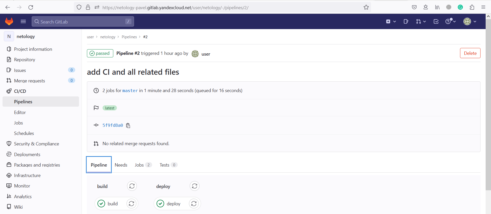
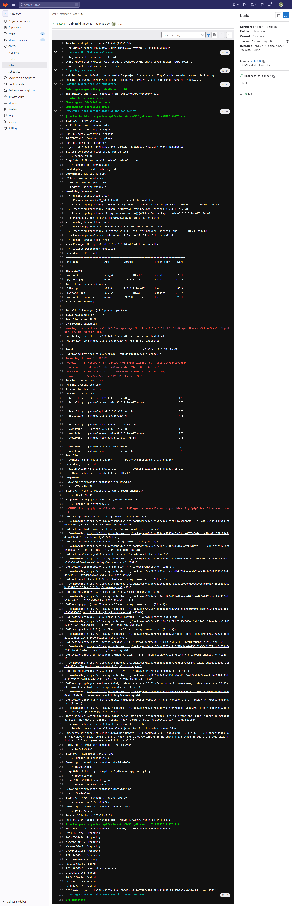
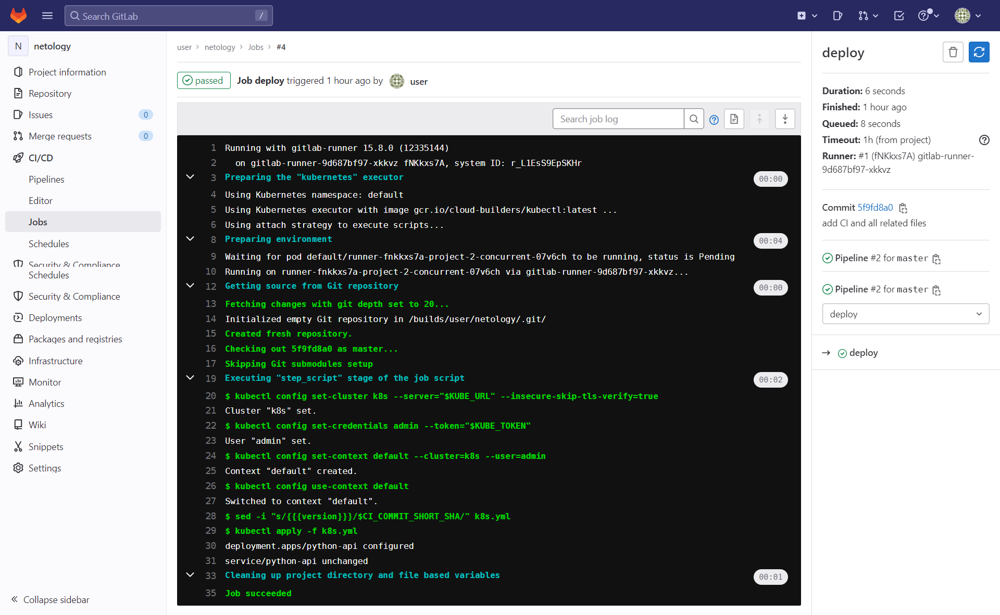
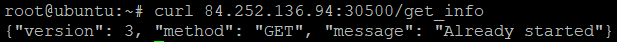
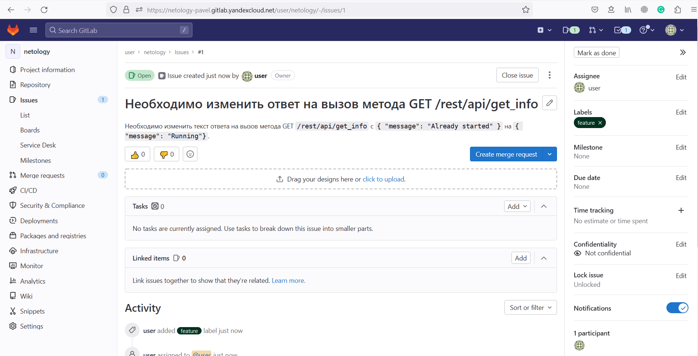
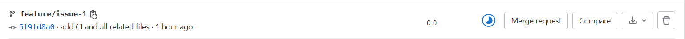
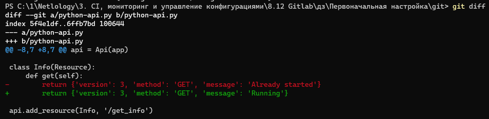
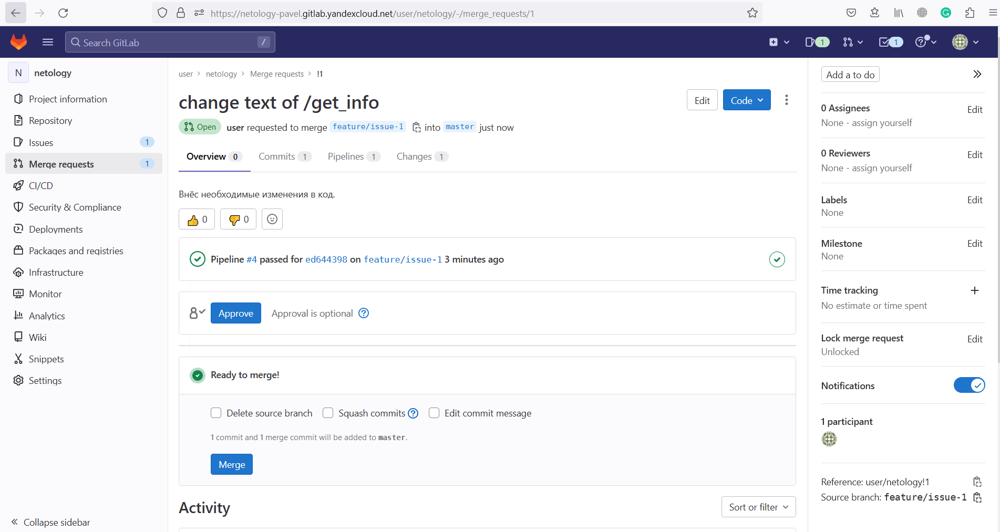
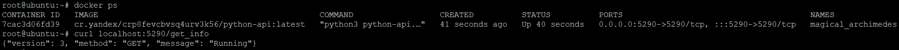
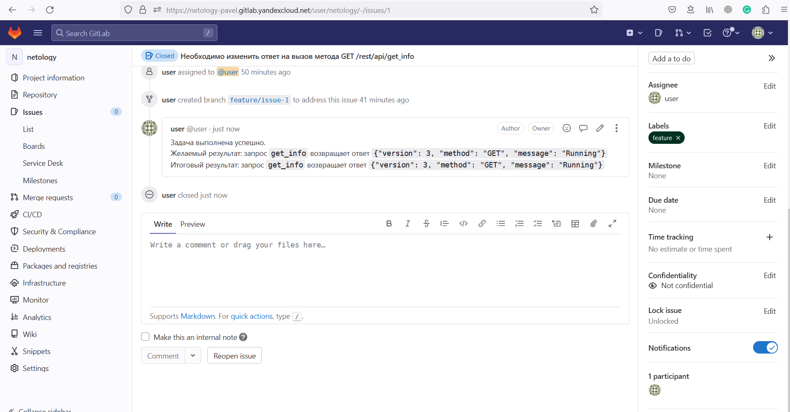

# Домашнее задание к занятию "12.Gitlab"
Файлы:  
[gitlab-CI](./files/.gitlab-ci.yml)  
[Dockerfile](./files/Dockerfile)

## DevOps
Выполненный pipeline:  
  
build stage:  
  
deploy stage:  
  
Отрабатывающий curl запрос к серверу:  

## Product Owner
Issue создан:  

## Developer
Ветка под issue создана:  

Необходимые изменения внесены:  
  
Merge request создан, сборка прошла успешно:  
  

## Tester
Контейнер запущен, запрос выполняется успешно:  
  
Issue закрыта с соответствующим комментарием:  

## Необязательная часть
Добавил в [CI](./files/.gitlab-ci.yml) test stage в котором запускает контейнер с собранным образом и выполняется curl к нему.